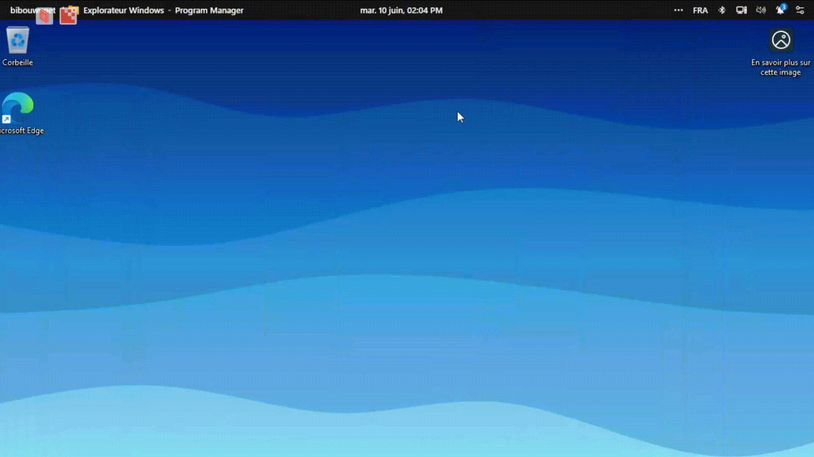

## Table of Contents

- [Access Seelen UI](#Access-Seelen)
- [Install Plugins](#chapter-2-installation)
  - [Chapter 2.1: Requirements](#chapter-21-requirements)
- [Chapter 3: Usage](#chapter-3-usage)

# Access-Seelen
To access seelen UI's UI, right click on the tool-bar, on top of the screen, then click settings

  

